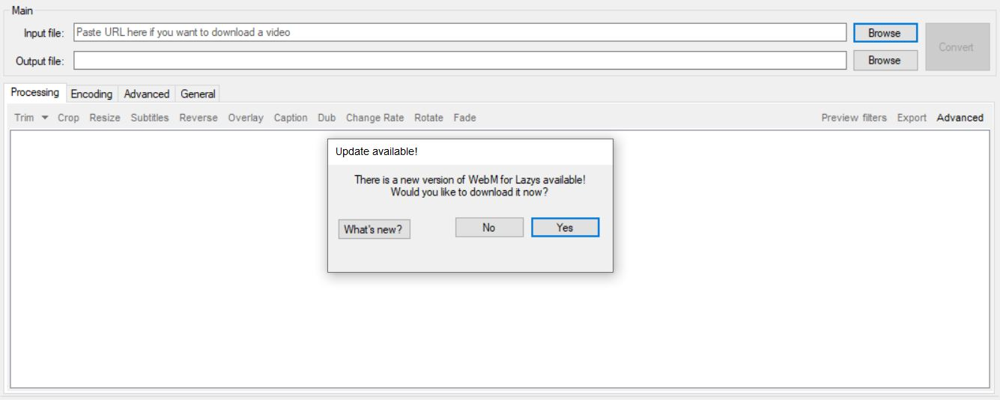
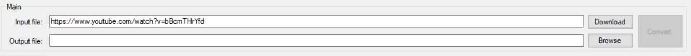
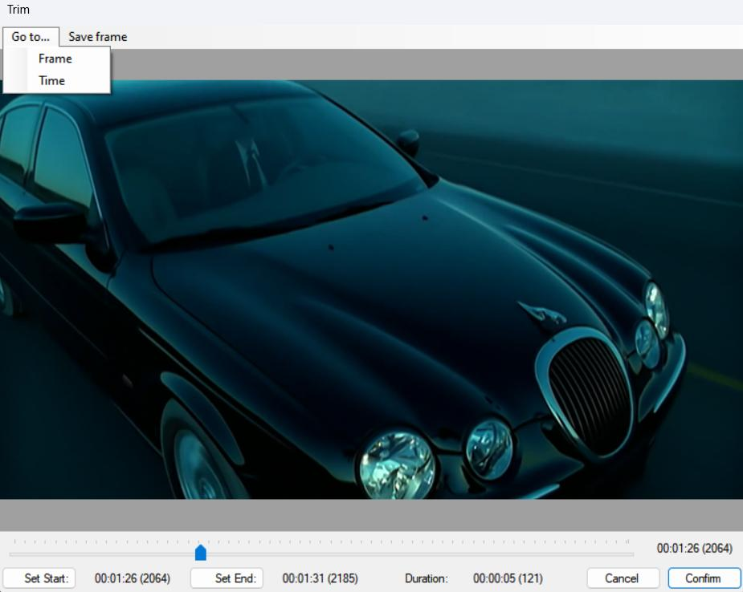
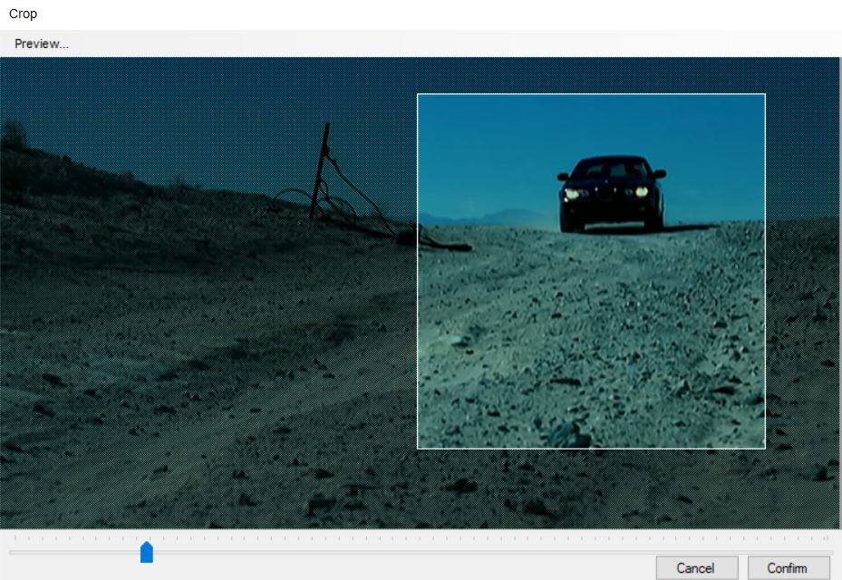
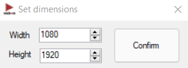
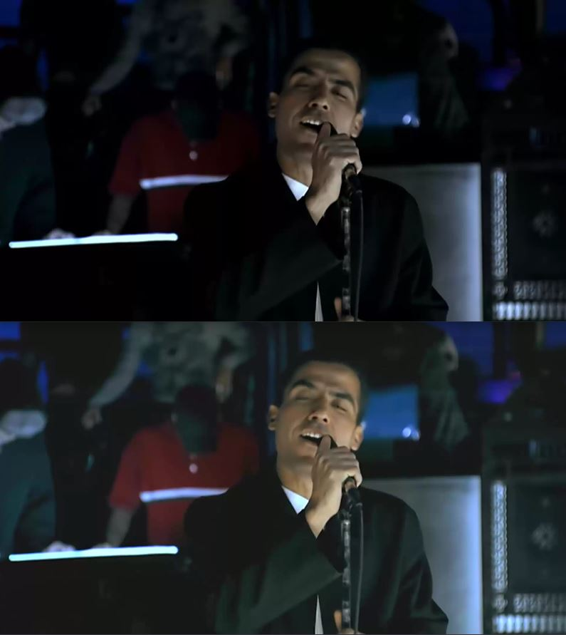
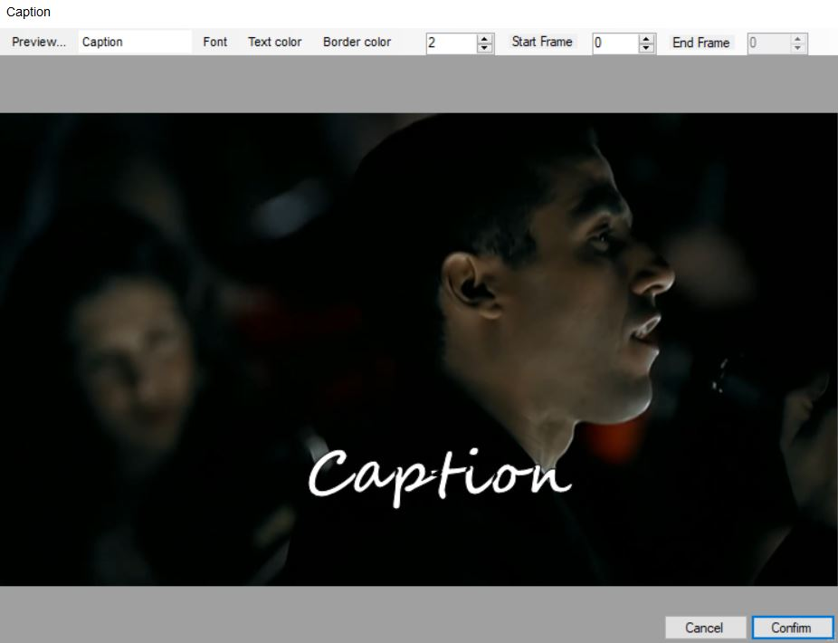
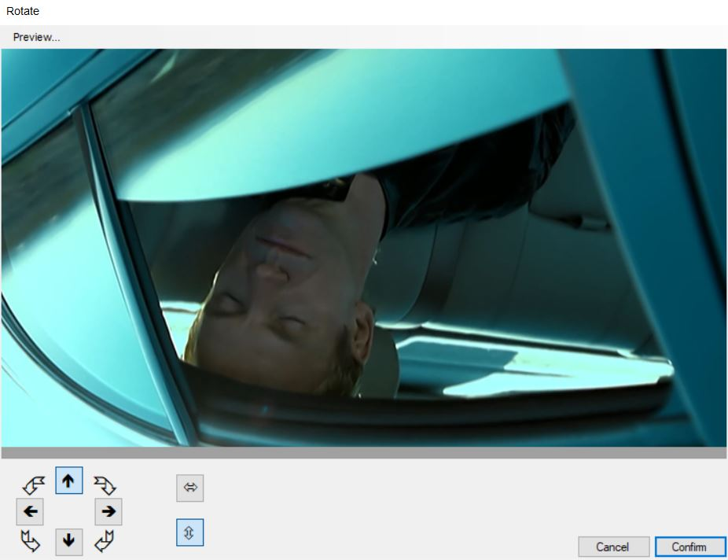

WebM for Lazys 
=============
[](https://www.codacy.com/gh/argorar/WebMConverter/dashboard?utm_source=github.com&amp;utm_medium=referral&amp;utm_content=argorar/WebMConverter&amp;utm_campaign=Badge_Grade)
[](https://opensource.org/licenses/MIT)
[]()
[]()

If you want to support this project.

<a href='https://ko-fi.com/argorar' target='_blank'></a> 

A wrapper around ffmpeg and AviSynth made for converting videos to WebM without having to use the command line, fork of [this project](https://gitgud.io/nixx/WebMConverter#webm-for-retards-).

- **Download it [here][LatestDownload].**

_Important to know:_
* Requires .NET Framework 4.5 (Windows 7 comes with 3.5, so you might want to [update][DotNet45])
* Requires [AviSynth][AviSynth] (2.6.0, 32-bit)
* Already includes ffmpeg
* Only works on Windows 

## About WebM

WebM is an open, royalty-free, media file format designed for the web.
WebM defines the file container structure, video and audio formats. WebM files consist of video streams compressed with the VP8 or VP9 video codecs and audio streams compressed with the Vorbis or Opus audio codecs. The WebM file structure is based on the Matroska container.

For more information about WebM, see the [FAQ][FAQ].

## Benefits of WebM

* _Openness and innovation_. A key factor in the web's success is that its core technologies such as HTML, HTTP, and TCP/IP are open for anyone to implement and improve.  With video being core to the web experience, a high-quality, open video format choice is needed. WebM is 100% free, and open-sourced under a BSD-style license.

* _Optimized for the web_. Serving video on the web is different from traditional broadcast and offline mediums. Existing video formats were designed to serve the needs of these mediums and do it very well. WebM is focused on addressing the unique needs of serving video on the web.

    * Low computational footprint to enable playback on any device, including low-power netbooks, handhelds, tablets, etc

    * Simple container format

    * Highest quality real-time video delivery

    * Click and encode. Minimal codec profiles and sub-options. When possible, let the encoder make the tough choices.

# WebM for Lazys features

## Updates

Get the last update with just one click.



## What can i do?

You can get and edit your video easly with the next options.

### Download

Paste the url of the video you want and press enter, the download will start. You will get the best quality.
* Support for [+1000 sites][Sites]
* You can choose the default path for all your new videos
* Load the new video in the app with just one click



### Trim

Trim precisely the length, with a simple interface. You can do multiple trims if you need.



### Crop

Crop what is just important for you, you can see in real time the new resolution also you can set the exact size that you want. Just move the edges with the mouse or use the keys to select the area.
* ```Row keys``` to move
* ```Shift + Row keys``` to move faster
* ```Alt + Row Keys``` to increase/decrease the size 
* ```Ctrl + Right or Left``` to change preview
* You can use mouse wheel over time line



### Dynamic Crop

Follow an object on the canvas easly. Steps for a correct workflow:
    
1. Use trim to define the clip lenght

2. Open Crop filter and define the crop size, use ```New resolution``` as guide. **Even numbers are required**. You can use ```Set dimensions``` for exact values
    
    
3. Select click ```Dynamic Crop```. When it is actived will be green which means that each movement will be registered
    
4. Set stabilitation level on ```Advanced>Processing``` to get a smooth effect

#### Tutorial

For this example the edition requires 30 seconds. 
<video style="width:100%" controls src="https://giant.gfycat.com/AridComplexKawala.mp4" type="video/mp4" autoplay loop></video>

[External link](https://gfycat.com/AridComplexKawala)

#### Final result

Right side was processed  with dynamic crop.
<video style="width:100%" controls src="https://giant.gfycat.com/WeeklyEmptyDalmatian.mp4" type="video/mp4" autoplay loop></video>

[External link](https://gfycat.com/WeeklyEmptyDalmatian)

### Filter

If your video looks dark, you can try with some pre-set filters. Now you can create your own filter using *Advanced* option, change gamma, contrast and saturation.



### Caption

Add text, change font, size, position, also set when it start and end.



### Rotate
Rotate your video to any direction with just one click.



### Loop

Loop function, forward and reverse making an infinite effect. You _can't_ use filter or interpolation with it.
<video style="width:100%" controls src="https://giant.gfycat.com/AnimatedUnimportantAlligatorsnappingturtle.mp4" type="video/mp4" autoplay loop></video>

[External link](https://gfycat.com/AnimatedUnimportantAlligatorsnappingturtle)

### Stabilization

Use different levels of stabilization for your clip. Left side original, right side processed. Find it in Advanced>Processing.

<video style="width:100%" controls src="https://giant.gfycat.com/DentalAnchoredHedgehog.mp4" type="video/mp4" autoplay loop></video>

[External link](https://gfycat.com/DentalAnchoredHedgehog)

### Merge
Drag and drop video files inside the application, search for the new video in source path. *The group of videos must have the same encodes / dimensions*.

### There is More that you can do

* Export frames
* Add subtitle
* Resize 
* Reverse
* Overlay your logo
* Change the speed
* Fade
* Disable audio
* Delay audio
* Get specific filesize in final result
* Get high quality video in webm and mp4 format
* Interpolate, more frames to your video
* Deinterlace

### Upload to Gfycat

Upload your new masterpiece with just one click. *A Gfycat account is required.*
See user details in tab *General*. If you are creating several gfys of the same topic, tags can be usefull for you.

### Shortcut keys

* Trim: ```Alt + t```
* MultiTrim: ```Alt + Shift + t```
* Crop: ```Alt + c```
* Change Rate: ```Alt + Shift + c```

## Changelog

#### Version 3.18.6
* Fix audio desync with some encodes like footage recorded by Nvidia Geforce Experience.

#### Version 3.18.5
* Add option to enable alpha channel aside with VP9 encoders for WebM. Find it in Advanced section. 

#### Version 3.18.4
* Fix update arguments when advanced filter settings change

#### Version 3.18.3
* Size limit feature now is more reliable
* Managed error saving configuration

#### Version 3.18.2
* VP9 convertion is more fast now

#### Version 3.18.1
* Not longer requires Microsoft Visual C++ 2010 (x86)

#### Version 3.18.0
* VP9 now is default for fresh installs, your current setting will be remembered
* Advance users can edit/add arguments before convert in ```Advanced>Arguments```
* ffmpeg updated
* Changed convert console output for more easy reading. Thanks to **@myblindy**
* fix out of bounds moving crop with keyboard
* Depured download console
* fix broken WebMConverter.Updater.exe
* fix a bug in change rate form, press enter after changes values doesn't save them
* fix a bug in resize form, it doesn't load the values saved previously

#### Version 3.17.0
* Add save frames in trim form
* Add option to change interpolation type for stabilization if you want to experiment with other options
* Add rotation to trim's preview if the filter is applied
* Change interpolation type for stabilization to get a better result in dynamic crop
* Improved stabilization
* Fix bug when drop a video and doesn't update output filename
* Fix a bug in dynamic crop using keyboard arrows
* Fix duplicated frames in dynamic crop
* Fix bug in output filename when change destination folder
* Fix code style

#### Version 3.16.0
* Add dynamic crop. Follow an object on the canvas easily [check the instructions](#dynamic-crop)
* Fix bug cheking yt-dlp version

#### Version 3.15.0
* Changed youtube-dl to yt-dlp to get last updates and fixes to download videos without problem
* Update link to download C++ required package for beginners
* Fix bug to download best quality from youtube
* Minor corrections in workflow

#### Version 3.14.0
* Add automatic update of binaries. You always will have the latest updates
* Fix a bug with progress bar that closed the program

#### Version 3.13.0
* Add stabilization filter. Find it in Advanced>Processing. It comes with different levels of stabilization 
* Fix validation of output name

#### Version 3.12.0
* Since gfycat is changing webm for mp4, now you can convert in high quality in mp4 format. Options in Encoding>Video
* Add Hardware Acceleration to encode for users with NVIDIA GPU
* Add validation of output name, if is the same as input *-1.xxx* is added
* Fixed accuracy in set dimensions in crop
* Fixed bug that generate muted clips with dub filter
* Add delay audio. Explore in Encoding > Audio
* Change Rotate icon

#### Version 3.11.0
* Add button to open downloaded videos folder
* Add simple option to convert to mp4 for shared files into platforms where webm is not supported. Option is in tab general
* Internal structure changed, now is dynamic allowing to do cool things on future
* Fix arguments for advanced filter
* Update binaries to fix JS player extraction in download feature

#### Version 3.10.0
* Add advanced filter. Now you can change contrast, gamma and saturation and find the right values for your video
* Check if the application is already running to avoid errors, shows a warning to user. It can be disable
* When you add a new multi trim, it load at the end of previous trim
* Add option to choose which CRF value to use depending on the resolution of the source. Check the general tab
* Add option to set the exact dimensions to crop
* Display just one decimal in crop resolution

#### Version 3.9.0
* Add shortcut keys for trim, multi trim, crop, and change rate
* Now you can see the new resolution of your crop

#### Version 3.8.0
* Add file size information after convert and gfycat uploader
* Add tags in tab General
* Update binaries
* Cleaning the garden

#### Version 3.7.0
* Display original FPS in interpolate box
* If value in interpolate box is 0, it will be removed
* Gfycat stats, see them in tab *General*
* Add option to log out of Gfycat
* Add feedback to merge files to avoid errors
* When you check VP9, the configuration will be remembered
* Add time line to crop filter
* Redundancy in preview eliminated in the filter trim, can bring a small improvement in performance
* Set CRF to 16 with 4k videos
* Set max audio quality as default
* Fix arguments when filter change
* Fix incorrect result message when convert with loop 

#### Version 3.6.0
* Add Loop function, forward and reverse making an infinite effect. You *can't* use filter or interpolation with it
* Add Dark Filter
* Enable ShareX option after convert
* Now sort files by the filename in merge videos
* Fix Unauthorized issue with gfycat
* Fix bug that break updates, some problem to get DNS with IPS
* Fix message error when you use interpolation
* Fix errors when you work offline
* Check if Microsoft Visual C++ 2010 (x86) is installed, if not, it will open the download page

#### Version 3.5.0
* Merge two or more videos in one, just drag and drop them inside the app. Search for the new merged file in source path
* *Limitations:* The group of videos must have the same encodes / dimensions

#### Version 3.4.0
* Deinterlace gets the job done efficiently. Remember to do this before editing, so the overall experience is not affected. You can use trim to save time and get what you need.
* Bring dark videos to light, try it in Advanced> Processing> Filters
* Minor changes to performance in filters

#### Version 3.3.0
* Download your video is easy now (support +1000 sites), [see more information.][Sites]
* Now you can working editing other video while the file upload to gfycat
* Improved performance of function to get frames on multiprocessor systems
* Fixed Gfycat title
* Interpolation result is better now
* Minor changes in *New update available*
* Fixed when your drop a file, that make your settings reset

#### Version 3.2.0
* Now you can set when you want your caption to start and end
* In caption form you can advance frame by frame changing *start frame* value. You can use mouse wheel too
* Changed algorithm to interpolate
* Now the update feature is enabled

#### Version 3.1.0
* Added option to interpolate frames in Advanced/Encoding
* Improved trim lag going forward with 4k videos

#### Version 3.0.0
* Fixed laggy trim functionality (with 4k files is a still a little slower)
* Now you can use Space key to play 100 frames in trim functionality
* Set the exact % value in change rate functionality 
* Now your settings are remembered 
* Gfycat integration using browser-based OAuth authentication. Upload your gfy after convert with one click

## License
This software is released under the MIT license.


## Issues
If you have any issues with this program, you may report them on [here][NewIssue].

 [LatestDownload]: https://github.com/argorar/WebMConverter/releases/latest
 [DotNet45]: https://www.microsoft.com/en-us/download/details.aspx?id=30653
 [AviSynth]: http://avisynth.nl/index.php/Main_Page#Official_builds
 [NewIssue]: https://github.com/argorar/WebMConverter/issues
 [Sites]: https://ytdl-org.github.io/youtube-dl/supportedsites.html
 [FAQ]: https://www.webmproject.org/about/faq/