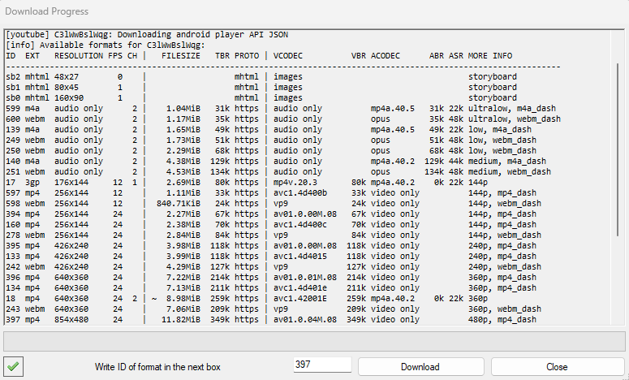
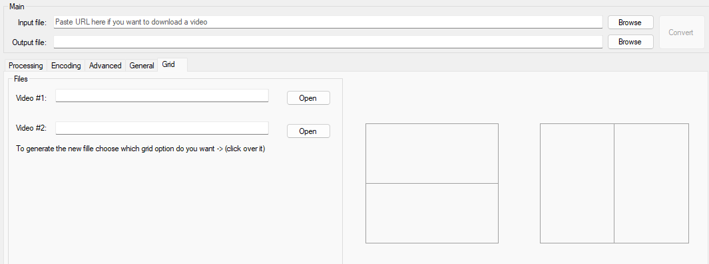
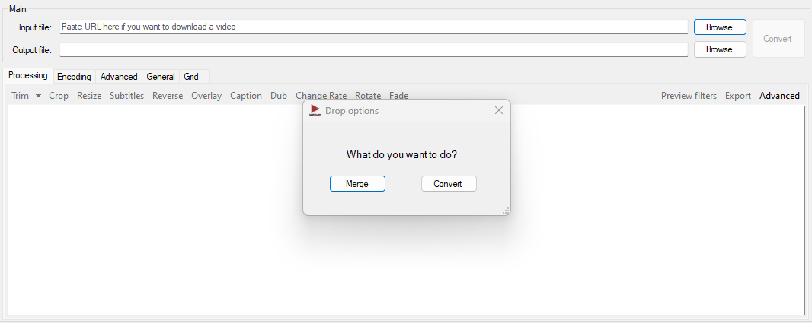

WebM for Lazys 
=============
[](https://www.codacy.com/gh/argorar/WebMConverter/dashboard?utm_source=github.com&amp;utm_medium=referral&amp;utm_content=argorar/WebMConverter&amp;utm_campaign=Badge_Grade)
[](https://opensource.org/licenses/MIT)
[]()
[]()

Don't forget to give a star in Github. If you want to support this project [https://paypal.me/argorar](https://paypal.me/argorar).

<a href='https://ko-fi.com/argorar' target='_blank'></a> 

A wrapper around ffmpeg and AviSynth made for converting videos to WebM without having to use the command line, fork of [this project](https://gitgud.io/nixx/WebMConverter#webm-for-retards-).

- **Download it [here][LatestDownload].**

_Important to know:_
* Requires .NET Framework 4.8
* Requires [AviSynth][AviSynth] (2.6.0, 32-bit)
* Already includes ffmpeg
* Only works on Windows 

## About WebM

WebM is an open, royalty-free, media file format designed for the web.
WebM defines the file container structure, video and audio formats. WebM files consist of video streams compressed with the VP8 or VP9 video codecs and audio streams compressed with the Vorbis or Opus audio codecs. The WebM file structure is based on the Matroska container.

For more information about WebM, see the [FAQ][FAQ].

## Benefits of WebM

* _Openness and innovation_. A key factor in the web's success is that its core technologies such as HTML, HTTP, and TCP/IP are open for anyone to implement and improve.  With video being core to the web experience, a high-quality, open video format choice is needed. WebM is 100% free, and open-sourced under a BSD-style license.

* _Optimized for the web_. Serving video on the web is different from traditional broadcast and offline mediums. Existing video formats were designed to serve the needs of these mediums and do it very well. WebM is focused on addressing the unique needs of serving video on the web.

    * Low computational footprint to enable playback on any device, including low-power netbooks, handhelds, tablets, etc

    * Simple container format

    * Highest quality real-time video delivery

    * Click and encode. Minimal codec profiles and sub-options. When possible, let the encoder make the tough choices.

# WebM for Lazys features

## Updates

Get the last update with just one click.


## What can i do?

You can get and edit your video easly with the next options.

### Download

Paste the url of the video you want and press enter, the download will start. You will get the best quality.
* Support for [+1000 sites][Sites]
* You can choose the default path for all your new videos
* Load the new video in the app with just one click


Disable option in *general* tab to select manually the format do you want.



To download just a part from a youtube video add ```@*start-end``` e.g.
 ```https://www.youtube.com/watch?v=_gbUT3AOg@*5:35-5:45```
 
### Trim

Trim precisely the length, with a simple interface. You can do multiple trims if you need.
**Go to..** the exact frame or time you want to start the trim, also save the current frame to source path. 


Click over trim timestamp start or end, preview will jump to the specific frame.

### Crop

Crop what is just important for you, you can see in real time the new resolution also you can set the exact size that you want or set an aspect ratio like 16:9, 9:16 and more under *Set dimensions*. 
Just move the edges with the mouse or use the keyboard.
* ```Row keys``` to move
* ```Shift + Row keys``` to move faster
* ```Alt + Row Keys``` to increase/decrease the size 
* ```Ctrl + Row Keys``` to resize keeping aspect ratio
* You can use mouse wheel over time line to change of frame


### Dynamic Crop

Follow an object on the canvas easly. Steps for a correct workflow:
    
1. Use trim to define the clip lenght (optional)

2. Open Crop filter and select ```Dynamic Crop```. When it is actived will be green which means that each movement will be registered
    

3. Define the crop size. **Even numbers are required**
    
    


#### Tutorial

For this example the edition requires 30 seconds. 


https://github.com/argorar/WebMConverter/assets/9936760/2cfae1bb-9bbc-43cc-9b87-3051e8dcc171

<div style="width:100%;height:0px;position:relative;padding-bottom:79.564%;"><iframe src="https://streamable.com/e/zuodf6" frameborder="0" width="100%" height="100%" allowfullscreen style="width:100%;height:100%;position:absolute;left:0px;top:0px;overflow:hidden;"></iframe></div>

#### Final result

Right side was processed  with dynamic crop.

https://github.com/argorar/WebMConverter/assets/9936760/9ba0fa57-a9e4-44d6-b0e2-e8dec45db3a2

<div style="width:100%;height:0px;position:relative;padding-bottom:28.125%;"><iframe src="https://streamable.com/e/scdumm" frameborder="0" width="100%" height="100%" allowfullscreen style="width:100%;height:100%;position:absolute;left:0px;top:0px;overflow:hidden;"></iframe></div>


### Dynamic Speed

Add specific speed to just a section of video:
    
1. Use trim to define the clip lenght

2. Dynamic filter will be enable
3. Add points in the frame you want with the desire rate (a final ¯\ _ /¯ shape is recomended)
4. There is not limit for points

#### Tutorial


https://github.com/argorar/WebMConverter/assets/9936760/cd523c93-7073-4d90-b17a-275a40d1b0d8


<div style="width:100%;height:0px;position:relative;padding-bottom:48.525%;"><iframe src="https://streamable.com/e/sctlkh" frameborder="0" width="100%" height="100%" allowfullscreen style="width:100%;height:100%;position:absolute;left:0px;top:0px;overflow:hidden;"></iframe></div>

#### Final result

A specific section is slowdown.


https://github.com/argorar/WebMConverter/assets/9936760/7fb63afe-8b0a-41c4-9c48-f3322ae8d4ed

<div style="width:100%;height:0px;position:relative;padding-bottom:56.250%;"><iframe src="https://streamable.com/e/9efgul" frameborder="0" width="100%" height="100%" allowfullscreen style="width:100%;height:100%;position:absolute;left:0px;top:0px;overflow:hidden;"></iframe></div>

an)
### Grid

Make grid videos to compare or shared different views. You can choose between horizontal or vertical. It requires that both videos share codecs, dimensions, length. Output file is in same path as video #1. Above you can find an example.



### Filter

If your video looks dark, you can try with some pre-set filters. Now you can create your own filter using *Advanced* option, change gamma, contrast and saturation.


### Caption

Add text, change font, size, position, also set when it start and end.


### Rotate
Rotate your video to any direction with just one click.


### Loop

Loop function, forward and reverse making an infinite effect.

https://github.com/argorar/WebMConverter/assets/9936760/9117aa8c-576d-4e13-9a65-b4be9890b0a3

<div style="width:100%;height:0px;position:relative;padding-bottom:56.250%;"><iframe src="https://streamable.com/e/g68tkh" frameborder="0" width="100%" height="100%" allowfullscreen style="width:100%;height:100%;position:absolute;left:0px;top:0px;overflow:hidden;"></iframe></div>

### Stabilization

Use different levels of stabilization for your clip. Left side original, right side processed. Find it in Advanced>Processing.


https://github.com/argorar/WebMConverter/assets/9936760/5ea1aa80-b39c-433f-8113-0fda8b651375

<div style="width:100%;height:0px;position:relative;padding-bottom:28.125%;"><iframe src="https://streamable.com/e/cgdttx" frameborder="0" width="100%" height="100%" allowfullscreen style="width:100%;height:100%;position:absolute;left:0px;top:0px;overflow:hidden;"></iframe></div>

### Merge and Convert
Drag and drop two or more video files inside the application, select what do you want to do. Search for the result in source path. 
* For merge: *The group of videos must have the same encodes / dimensions*.
* For convert: *The current settings will be apply to all video files*



### There is More that you can do

* Export frames
* Add subtitle
* Resize 
* Reverse
* Overlay your logo
* Change the speed
* Fade
* Disable audio
* Delay audio
* Get specific filesize in final result
* Get high quality video in webm and mp4 format
* Interpolate, more frames to your video
* Deinterlace
* Denoise

### Shortcut keys

* Trim: ```Alt + t```
* MultiTrim: ```Alt + Shift + t```
* Crop: ```Alt + c```
* Change Rate: ```Alt + Shift + c```

### Supporters
* Chibi
* bouteloua
* ManletPride
* 3nly

## Changelog

#### Version 3.42.0
* Add merge audio, in track selector choose mix all (only two tracks sopported now) [request](https://github.com/argorar/WebMConverter/issues/102)
* Expand support for HDR
* Fix webms with full range color aren't playing in Chrome [issue](https://github.com/argorar/WebMConverter/issues/103)

#### Version 3.41.1
* Refactor mp4 codec selector

#### Version 3.41.0
* Add HDR10 bits support
* Fix darker colors in Chromium browsers
* Fix horizontal and vertical rotation [issue](https://github.com/argorar/WebMConverter/issues/99)
* Fix subtitles with crop
* Fix subtitles [issue](https://github.com/argorar/WebMConverter/issues/98)
* Fix some scenaries to update output filename
* Fix Subtitles get cropped [issue](https://github.com/argorar/WebMConverter/issues/93)
* Fix "Create another" button's suffix malfunctions after 10th file [issue](https://github.com/argorar/WebMConverter/issues/89)
* Now you can set size limit default, find it in *General* tab [request](https://github.com/argorar/WebMConverter/issues/88)
* Fix for ffmpeg/ffprobe long paths not working by @DoTheSneedful
* Set color range metadata to full levels for a correct color interpretation

#### Version 3.40.0
* Now you can set default values to caption filter, find it in *General* tab
* Allow long file names by @DoTheSneedful
* Improve workflow using dynamic filters
* Fix *Resize* window not showing in second monitor

#### Version 3.39.0
* Add in caption filter crop zone when it exist previously
* Improve preview performance 
* Improve shadow under dynamic points
* Refactor rotate filter to ffmpeg commands
* Update ffmpeg to v6.1

#### Version 3.38.0
* Add audio amplification option
* Increase cache size for preview frames
* Minor changes underhood and UI

#### Version 3.37.0
* Add remove option in multi trim. See related [request](https://github.com/argorar/WebMConverter/issues/73)
* Fix target bitrate using constant mode
* Fix size limit using constant mode and change rate filter. See related [issue](https://github.com/argorar/WebMConverter/issues/69)
* Fix yt-dlp.exe v2024.03.10 process. See related [issue](https://github.com/argorar/WebMConverter/issues/72)

#### Version 3.36.0
* Add option after convert *Create another*, this will change the output file to -2, -3,.., -n
* Fix filenames when you download many clips from the same file using @* introduced in 3.32.0

Special thanks to this month supporters:
* new top supporter **Chibi** ❤︎


To see more [changelog](CHANGELOG.md).

<a href='https://ko-fi.com/argorar' target='_blank'></a> 

## License
This software is released under the MIT license.


 [LatestDownload]: https://github.com/argorar/WebMConverter/releases/latest
 [DotNet45]: https://www.microsoft.com/en-us/download/details.aspx?id=30653
 [AviSynth]: http://avisynth.nl/index.php/Main_Page#Official_builds
 [NewIssue]: https://github.com/argorar/WebMConverter/issues
 [Sites]: https://ytdl-org.github.io/youtube-dl/supportedsites.html
 [FAQ]: https://www.webmproject.org/about/faq/
